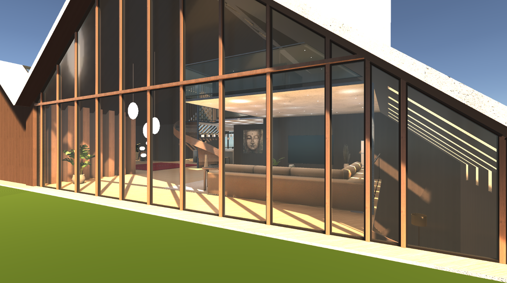

This github page holds the updated version of the Unity plugin Realtime-CSG

If you use this plugin, please let us know, we'd love to see what you've done with it!

Programmer art example. Note: couch, plants and some other small props are meshes, not CSG

**How to install**:
---
**Git (Requires having [git](https://git-scm.com/) installed)**

* In the `Assets/` or `Packages/` folder of your project, in the command line, use the git command `git clone https://github.com/LogicalError/realtime-CSG-for-unity.git RealtimeCSG`

**Manual Download**

* [Download this repo](https://github.com/LogicalError/realtime-CSG-for-unity/archive/refs/heads/master.zip)
* Copy the folder in the downloaded zip to anywhere in your `Assets/` folder, or to the `Packages/` folder.
* Rename the downloaded folder to `RealtimeCSG`

**Unity Package Manager (UPM)**

* Use the package manager to import the project using `https://github.com/LogicalError/realtime-CSG-for-unity.git`

---

**Updating:**
---
**Git**

* Run `git merge master` in the console, from the RealtimeCSG folder

**Manual Update**
* Close Unity
* Delete the RealtimeCSG folder
* Repeat the steps from "Manual Download" above

**Unity Package Manager (UPM)**
* Simpy update the package

---

**FAQs:**
---

**Q: Does RealtimeCSG support runtime editing?**

  * A: **No.** RealtimeCSG does **not** support or have API for runtime editing. This does not stop you from using the native binary to create your own bindings to use. We do not provide support for that, so you are on your own in doing this. If you are unsure where to start, [then you can check out the native folder](https://github.com/LogicalError/realtime-CSG-for-unity/tree/master/Plugins/Editor/Scripts/Control/Bindings), which has the bindings that RealtimeCSG uses.

**Q: How do I turn RealtimeCSG off in the editor?**

  * A: Simply press CTRL+F3 to toggle it!

**Q: Can I use RealtimeCSG to edit other meshes?**

  * A: No. RealtimeCSG is intended to work with its own brushes, which generates its own output mesh. It cannot be used for that purpose.

**Q: Can I have access to the native C++ code?**

  * A: No. Unless stated otherwise, it will not be available to the public. Sorry for that.

**Q: Is there a build of the native binary for my OS distro?**

 * A: RealtimeCSG currently supports the following platforms:
   - Windows x64
   - MacOS

   There are plans and work being done in the background to bring support to Linux. This does not mean it will support *all* linux distros. Just the popular ones like Debian, Ubuntu, Mint, etc.

   Unsupported platforms:
   - Any ARM platforms. We don't have access to an ARM system. This may/may not change if one of us gets one, but it is unlikely.

**Q: Can I build RealtimeCSG for another OS?**

  * A: See "Can I have access to the native C++ code?".

**Links:**
---

* **Discord server**: https://discord.gg/BK5gt8R
* **Project website**: https://www.realtimecsg.com/
* **Asset Store (outdated)**: https://assetstore.unity.com/packages/tools/modeling/realtime-csg-69542

---

**Contributing:**
---

* Fork this repo
* Create your own branch
* Submit a PR (do not submit PRs from the master branch of your fork)

README last updated August 9th, 2023
